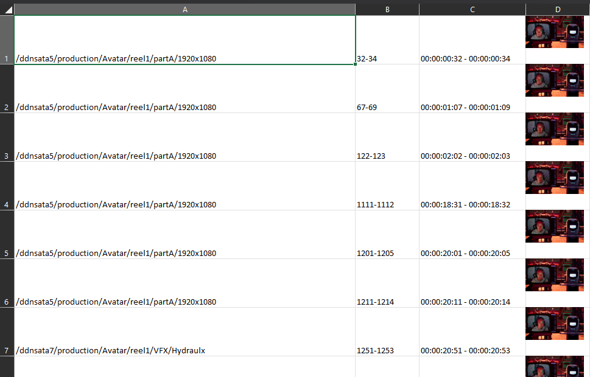
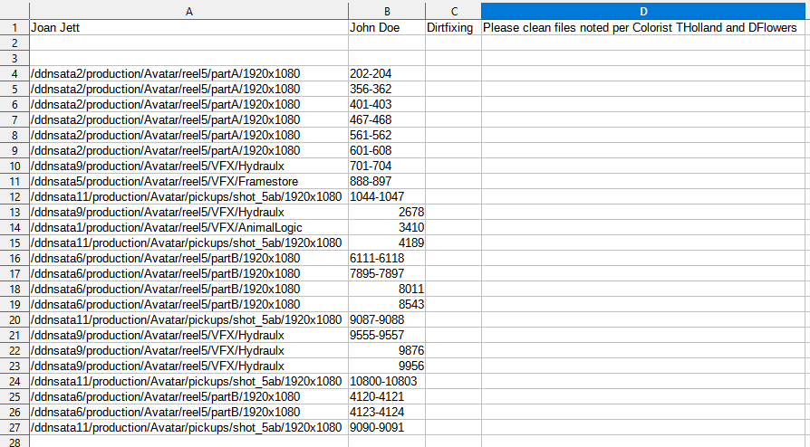

# multimedia marks script

A Multimedia System Design class project that automates 4 manual jobs.

* Parses Baselight, Flame, and Xytech files to find filesystem locations of frames.
* Saves results to a MongoDB database to be used for data analysis.
* Generates worker effeciency reports.
* Processes video files with ffmpeg.
* Exports CSV files and XLS files with timecodes and thumbnail previews.

